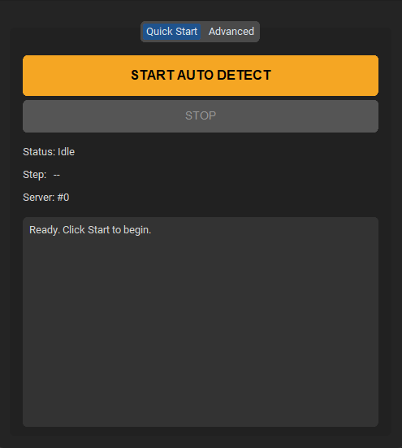

# windyhelper!

### a python-based program to automate server hopping for finding Wild Windy Bees in Roblox Bee Swarm Simulator
#### this will not fight windy bee or find where she is, its only to help you find servers where the chimes are moving

<p align="center>
  
	
</p>
# how to use
windows only sorry idk how to do mac
download the [latest release](https://github.com/6ojo/windyhelper/releases) and run the exe, or

## build it yourself
> python needed

clone the repo to where you want
navigate to where it is
> ```pip install -r requirements.txt```
> ```python main.py``` 
>or
>```python app.py```

use main if you want to use a terminal, or app for a simpler gui

## known bugs/limitations

 - sometimes if its calibrated for day, night will cause a false
   positive and vice versa.  this is inconsistent
 - balloons passing in front of the chime will cause a false positive
 - people using cannon can sometimes cause a false positive
 - if the game spawns you backwards (camera not facing hives) it has no idea and will continue as normal
 - the screenshot gui is really ugly

## thanks to

 - [nosyliam](https://github.com/nosyliam), creator of [revolution macro](https://github.com/nosyliam/revolution-macro)
 - [natro macro team](https://github.com/NatroTeam), creators of [natro macro](https://github.com/NatroTeam/NatroMacro)

without them or their code, i would have been very lost

```
